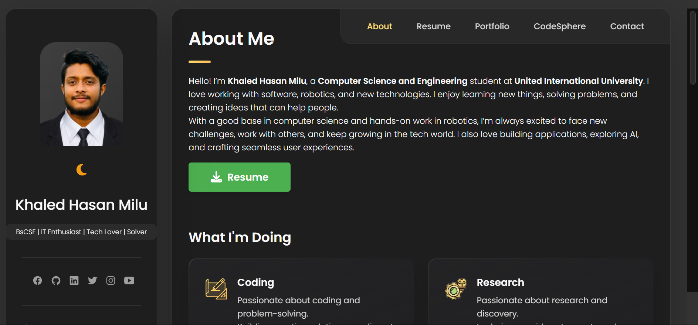
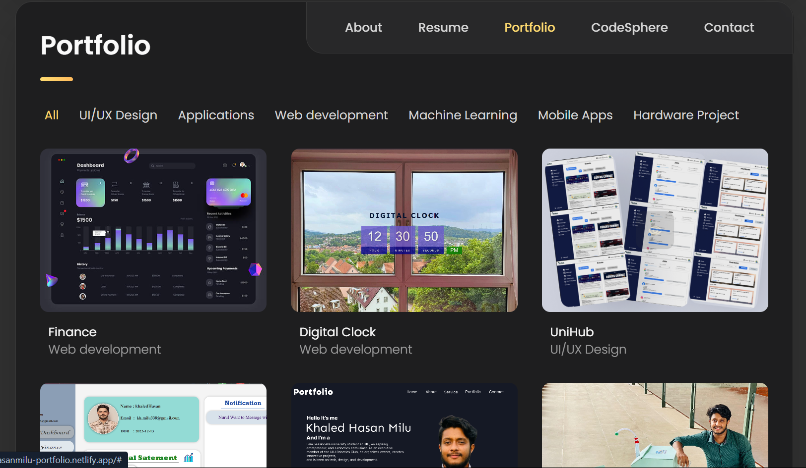
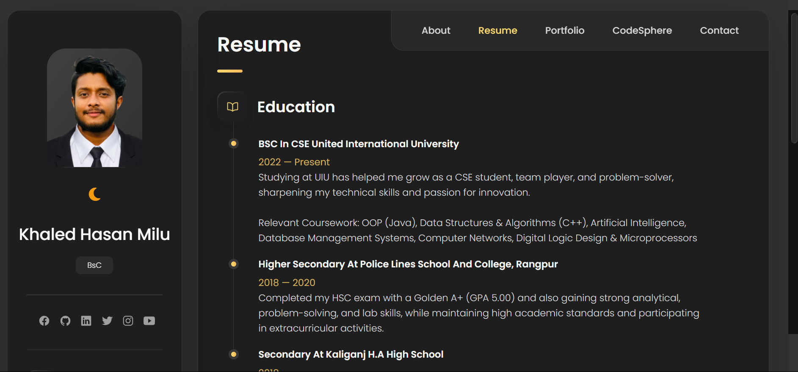
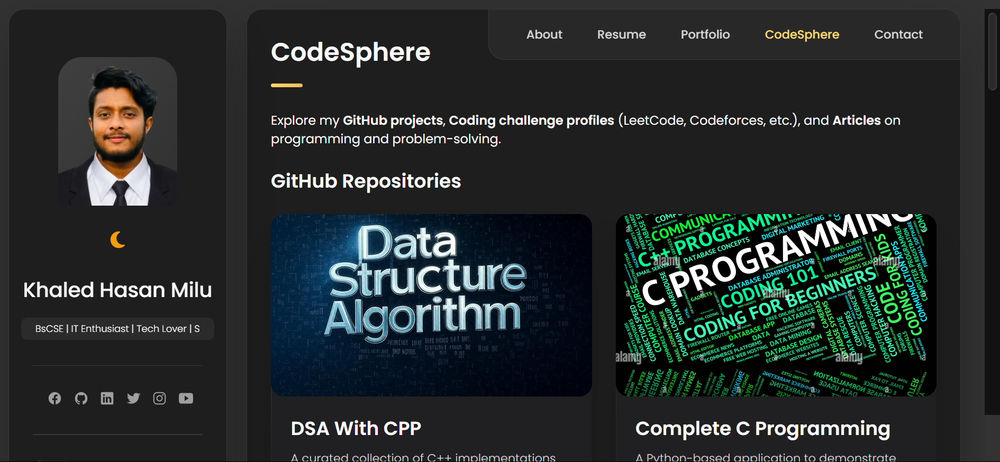
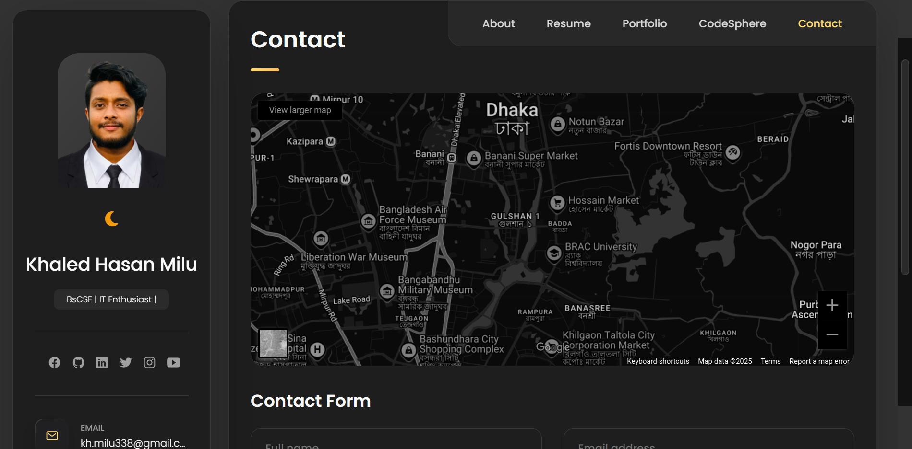

# 🚀 **Welcome to Khaled's Portfolio**

<br/>
Welcome to the source code of my personal developer portfolio 🌐  
Check out the live version here 👉 [khaledhasanmilu.netlify.app](https://khaledhasanmilu.netlify.app/)

---

## 👨‍💻 **About Me**

Hello! I’m **Khaled Hasan Milu**, a passionate Computer Science student and tech enthusiast from Bangladesh 🇧🇩.  
I specialize in crafting innovative software solutions, solving challenging problems, and designing seamless user experiences. My goal is to make an impact through technology while continuously learning and growing in the field of software development.

---

## 🧰 **Built With**

This portfolio is crafted using the following technologies:

- 🧱 **HTML5** – The structure of the web
- 🎨 **CSS3** – Styling to make it visually appealing
- ⚙️ **JavaScript** – For dynamic and interactive elements
- 💻 Hosted on [**Netlify**](https://www.netlify.com/)
- 🐱 Version-controlled with **GitHub**

---

## 📁 **Project Overview**

This portfolio showcases the following sections:

- 💻 **Web Projects** – A collection of my personal and collaborative web development projects.
- 🎨 **UI/UX Designs** – Creative and user-focused designs for websites and apps.
- 📱 **Mobile App Concepts** – Innovative mobile app concepts and prototypes.
- 📷 **Photography** – A visual gallery capturing moments and stories.
- 📊 **Research Work** – I’ve been involved in research and academic work.

---

## 📸 **Screenshots**

A sneak peek at the various sections of the portfolio:

<div align="center">
  
  
  
  
  
</div>

---

---

## 📬 **Get In Touch**

Feel free to connect with me through any of the following platforms:

- 📧 [**Email**](mailto:kh.milu338@gmail.com)
- 🔗 [**LinkedIn**](https://www.linkedin.com/in/khaledhasanmilu)
- 🐱 [**GitHub**](https://github.com/khaledhasanmilu)

Whether you have a question, an idea, or an exciting collaboration, I'm always open to talk! Let's create something amazing together. 🚀

---

## 📁 **Folder Structure**

Here’s a breakdown of the folder structure used for this portfolio:

```bash
.
├── assets/                  # Images, icons, logos, and other assets
│   └── images/
├── website-demo-image/      # Portfolio screenshots for documentation
├── css/
│   └── style.css            # Main stylesheet
├── js/
│   └── script.js            # JavaScript for interactivity
├── index.html               # Main landing page
├── README.md                # This file
├── .gitignore               # Files ignored by Git
└── netlify.toml             # Netlify deployment settings
```

## ❤️ **Acknowledgements**

A heartfelt thanks to:

- The open-source community provides countless tools and inspiration 🙌
- Mentors, friends, and fellow developers who supported and motivated me 💡
- All the creators who share their knowledge and help others grow 📚

Your influence helped bring this portfolio to life.

> **"Code is like poetry. When done right, it’s beautiful and meaningful."**


